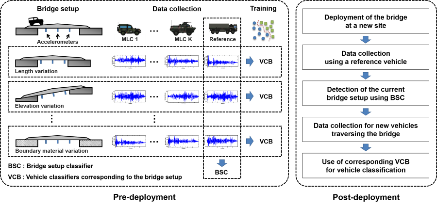
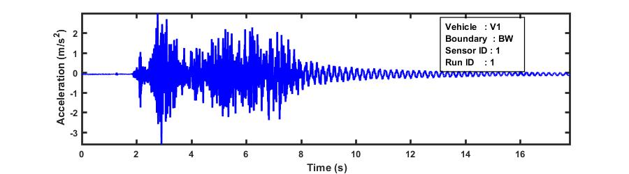
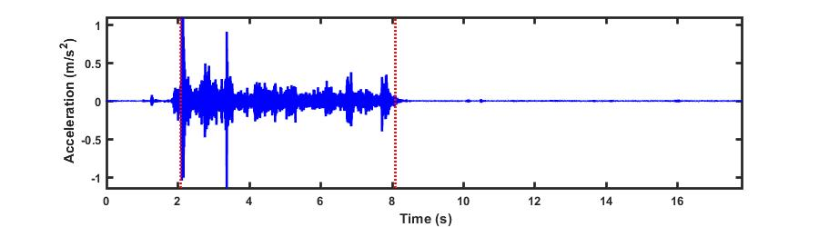
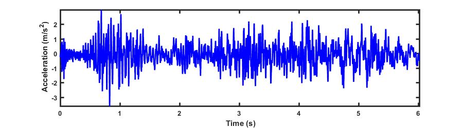
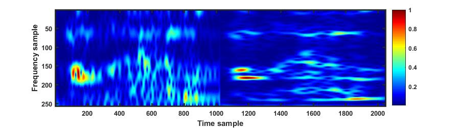
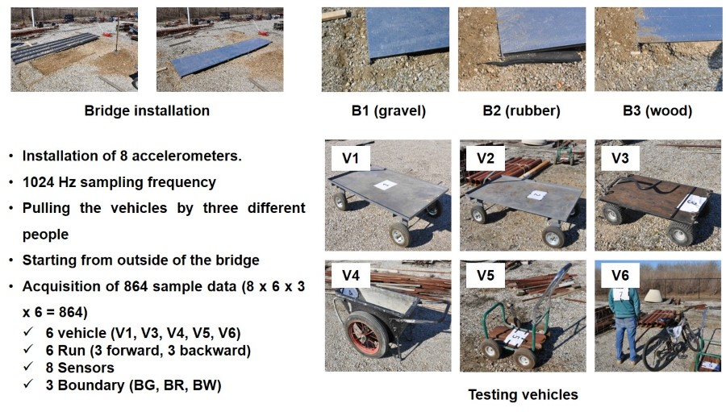
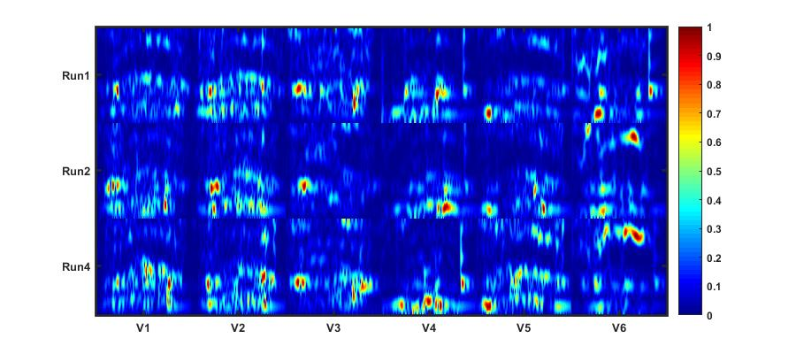
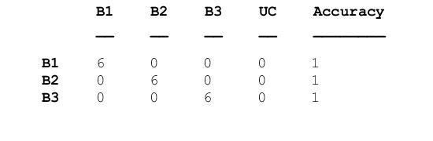
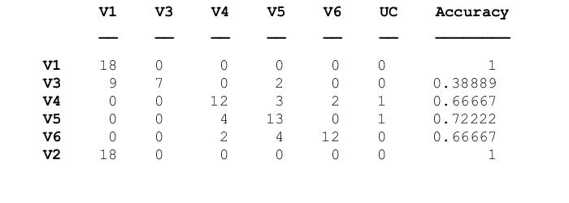

# Acceleration-based Automated Vehicle Classification on Mobile Bridges

## Description
Mobile bridges have been used for a broad range of applications including military transportation or disaster restoration. **Because mobile bridges are rapidly deployed under a wide variety of conditions, often remaining in place for just minutes to hours, and have irregular usage patterns, a detailed record of usage history is important for ensuring structural safety.** To facilitate usage data collection in mobile bridges, a new **acceleration-based vehicle classification technique is proposed to automatically identify the class of each vehicle**. Herein we present a new technique that is based on the premise that each class of vehicles produces distinctive dynamic patterns while crossing this mobile bridge, and those patterns can be extracted from the system’s acceleration responses. Measured acceleration signals are converted to time-frequency images to extract 2D patterns. The Viola-Jones object detection algorithm is applied here to extract and classify those patterns. The effectiveness of the technique is investigated and demonstrated using laboratory and full-scale mobile bridges by simulating realistic scenarios.

## Publication
*  **Chul Min Yeum**, Shirley J. Dyke, Ricardo E. Rovira, Christian Silva, and Jeff Demo. “Acceleration-Based Automated Vehicle Classification on Mobile Bridges.” Computer-Aided Civil and Infrastructure Engineering 31 (2016):813-825. [**[Web]**](http://onlinelibrary.wiley.com/doi/10.1111/mice.12212/full).

* Shirley J. Dyke, **Chul Min Yeum**, Christian Silva, and Jeff Demo. “Applications of computer vision in structural health monitoring.” (a keynote speech) Proceedings of the 7th Structural Health Monitoring and Intelligent Infrastructure, Italy, July1-4, 2015. 

## Source Code & Data
* All source code and **lab-scale experiment data** are released in **my Github repository**  [[**Link**]](https://github.com/chulminy/Acceleration_Based_Automated_Vehicle). 
* If you use the codes and data for you publication, **please cite my paper(s).**

## Collaborators

* [Shirley J. Dyke](https://engineering.purdue.edu/IISL/)
* Christian Silva
* Ricardo E. Rovira
* Jeff Demo

## Acknowledgment
The authors acknowledge support from Small Business Innovative Research (SBIR) Program and the Engineering Research and Development Center - Construction Engineering Research Laboratory (ERDC-CERL) under Contract No. W9132T-12-C-0020. The authors would also like to acknowledge fellowship support through the Purdue Military Research Initiative.

## Overview of the Proposed Technique
The fundamental idea behind the proposed technique is that each class of vehicles crossing a mobile bridge produces distinguishable dynamic (acceleration) patterns. Contrary to the case of permanent bridges, significant dynamic coupling between a mobile bridge and each class of vehicles are expected and their patterns are distinct and observable for classification. The dominant features of these patterns are preserved even with reasonable variations in the vehicle’s speed or mass. Such dynamic patterns appear in both temporal and spectral domains so features from both domains must be considered for robust classification.

Some assumptions are made, which are quite reasonable for such a mobile/temporary bridge: **(1)** one vehicle is crossing the mobile bridge at a time, **(2)** a given bridge setup does not vary greatly during usage, **(3)** vehicles traverse the bridge with a reasonably constant speed, and **(4)** vehicles within a given class of vehicles all produce similar dynamic patterns. The foundation for assumption **(4)** is that the similar axle load and the number of wheels and wheelbases are the dominant factors in producing the dynamic patterns on a mobile bridge. 

### Training of the Vehicle Classifiers

**Step 1. Acquisition of signals from all accelerometers installed on the bridges**  
All sensors are triggered simultaneously when a vehicle enters the bridge. In general, a vehicle entry event produces large accelerations similar to an impact load and the change can easily be distinguished. The signal below is measured using accelerometer 1 when V1 runs on a bridge having wood support first time. 

**Step 2. Estimation of vehicle exit time**  
The acceleration record to be used for classification should only contain data acquired while the vehicle is traversing the bridge. A major difficulty to estimate the exit time is that if the sudden exit of a vehicle acts as a large impact (releasing) force on the bridge and produce transient vibration, it would be difficult to estimate the time a vehicle exits using a simple amplitude-based threshold triggering method.

To address this issue, we use the fact that the transient vibration is determined by the bridge’s dynamic characteristics, which are mainly composed of **low frequencies**. A high-pass filter is implemented to filter out the transient vibration of the bridge and retain the high-frequency components induced by vehicle crossing and noise. 

The signal below is the one after implementing the **high pass filter** on the above signal in Step 1.

**Step 3. Signal cropping**  
Using the prior steps, valid acceleration signals, which are restricted to the time when a vehicle is crossing the bridge, are obtained by cropping the measured raw signals to start at the entrance time and end at the exit time. 

**Step 4. Spectrogram computation**  
Spectrograms are computed from original signals with the same number of points in the FFT and two different sizes of frames. The frame lengths of the short-time Fourier transform for spectrogram conversion vary by resolution in both time and frequency. Good resolution cannot be achieved in both time and frequency with only one frame size. Thus, in this study, the spectrogram image is constructed with two spectrogram transformations using two different sizes of frames, and extracting features from appropriate time and frequency resolutions, respectively. 

**Step 5. Integral image computation and feature extraction**  
Extracted features are used for distinguishing between images generated from different vehicles. A number of feature extraction techniques have been introduced in the literature for general or specific object detection and classification. Here, Haar-like features are implemented due to their domain-independency and computation speed. Features are computed by summing across a local rectangular region using Haar-like wavelets. For simplicity, 1, 2, 3 and 4 rectangular Haar-like feature windows are used, which was originally proposed by Viola and Jones. 

**Step 6. Learning vehicle classifiers**  
A set of robust binary classifiers for each vehicle are designed to determine whether or not the features in a test image point to the existence of a corresponding vehicle in the training data. In this study, a boosting algorithm is implemented to generate a robust classifier. Boosting is a way of combining many weak classifiers to produce a strong classifier. By updating the different weights of weak classifiers adaptively, depending on misclassification errors, the optimum strong classifier is obtained, thus minimizing misclassification errors. There are several boosting algorithms introduced in the literature, but in this study, the gentle boost algorithm, proposed by Friedman, is used because it is known as simple to implement, numerically robust and experimentally proven for object detection 

### Training of the Trained Vehicle Classifiers

**Step 1. Extract features by conducting Steps 1~6 in the training process**

**Step 2. Selection of the trained classifier by running a reference vehicle**  
The bridge setup classifier is applied to the extracted features to identify the bridge setup that is most similar to the current one and reduce the set of possible outcomes significantly. 

**Step 3. Applying the selected classifier to the new test data**

## Experimental Validation on a Lab-Scale Bridge

### Experimental Setup
To validate the technique under a variety of conditions, an experiment is conducted using a lab-scale bridge, shown in Fig. 3. This lab-scale experiment is intended to validate the following aspects of the technique: (1) distinguishable dynamic patterns (features) are generated and are contained within the acceleration signals; (2) the proposed technique can successfully classify vehicles into their respective classes by extracting such patterns; (3) reasonable variations in vehicle speed or the crossing direction do not affect the classification outcomes; and (4) the proposed technique is successful even when the bridge setup seen in the field is not specifically considered in the training stage.

This lab-scale bridge is dynamically similar to the full scale REB. Both bridges respond dynamically as a beam, with several participating modes. The vehicles are selected to have mass ratios similar mode shapes, and relative dynamics to the vehicles. Thus, the dynamic interactions between the vehicles and bridges are similar to those in the full scale bridge. It is designed to be portable, easy to mount and dismount, and can be installed using various boundary conditions and span distances. The bridge in Fig. 3(a) is constructed using four hollow squared section beams oriented lengthwise, each constructed as three 150cm long segments interconnected through connection plates. The 450 cm by 100 cm bridge surface is a thin aluminum sheet with 0.1 cm thickness, and covering the entire area spanned by the beams. The bridge is emplaced across a pit in the soil with enough clearance under the bridge to eliminate any chance of contact with the ground.

## Spectrogram images generated from three different crossings of six vehicles under B1 

The figure shows spectrogram images for each of the vehicles in a select number of runs associated with B1. Clearly, images from different runs of the same vehicle have quite similar visual patterns regarding the location and intensity of features, and images from different vehicles are often visually discernable. 

## Vehicle classification results
Please refer to [my journal paper](https://github.com/chulminy/Acceleration_Based_Automated_Vehicle) to understand the detailed configuration of the tasks for cross-validation.  
#### Table 1: Compute a confusion matrix of bridge setup classification uinsg V4 

#### Table 2: Confusion matrix for vehicle classification (use of training and testing data collected from an identical bridge setup)

#### Table 3: Confusion matrix for vehicle classification (training and testing data collected from different (closest) bridge setups)

